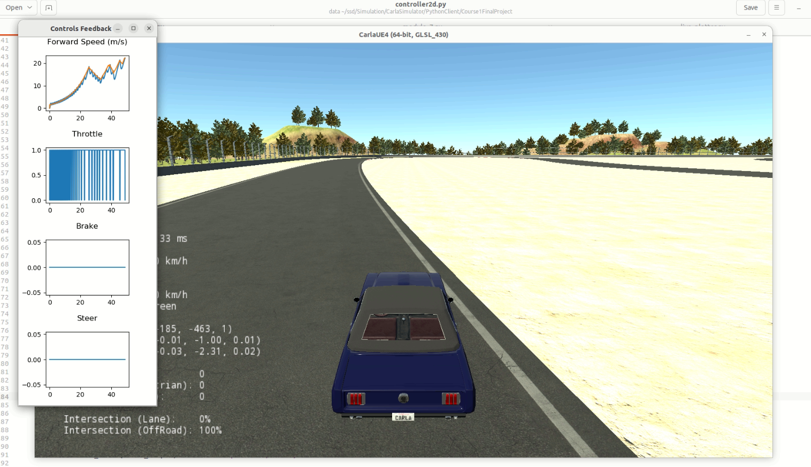
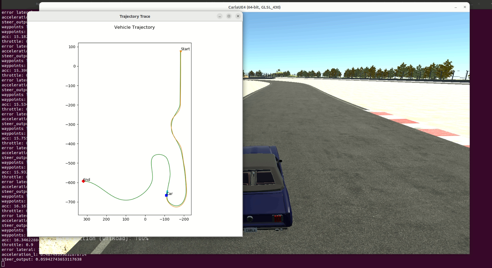

# Self-Driving

Repository for study of self driving vehicles.

## Course 1

Lateral and longitudinal control.
Simulation Carla, University of Toronto.
Racing track with a given waypoints: x, y, speed. Also yaw is known for each step of a cycle. Generate throttle, break and steering.

### Structure:

1. Controller_output constains of simulation graphs and trajectory.txt
2. Pictures contains of simulation screenshots
3. Controller2d.py realisation of longitudinal and lateral control
4. grade_c1m7.py test if generated trajectory is valid
5. module_7.py is an engine that uses controller
6. Racetrack_waypoints ground truth for x, y and velocity

#### Simulation.

#### Trajectory of a vehicle on the track.

